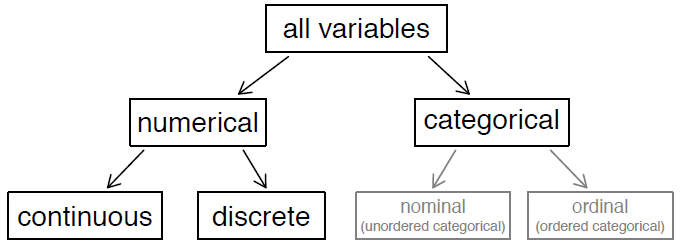
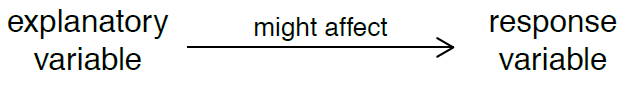

# Data

## Introduction

**Data** are observations collected from the field notes, surveys, and experiments which describe phenomena.

**Statistics** is the study of how best to collect, analyze, and draw conclusions from data.
  
Statistics follow the general process of investigation:
1. Identify a question or problem.
2. Collect relevant data on the topic.
3. Analyze the data.
4. Form a conclusion.

**Summary statistic** is a value computed from the data.

## Data Matrix

Also known as **Dataframe**.

Follow the [tidy data](https://github.com/CGodinho/R/blob/master/02-Concepts/tidy_data.md) principle with:

* Each **row represents** an **observation** (or case);
* Each **column** represents a **variable** (or characteristic). It is recommended to explicitly describe the variable content and units in an adjacent summary description.

## Variables

When two variables show some connection with one another, they are called **associated** variables (or dependent variables).

If 2 variables are not associated, they are **independent**.

## Population and Sample

A **sample** is a subset of a **population**. For practical reason, usually it is a small fraction.

## Anecdotal Evidence

Evidence from a small set of population may not be representative and lead to incorrect conclusions.
Examine a sample of many cases to have a better population representation.

**Random** selection is a good choice to avoid **bias**.

Another bias factors are related to **non-response** and **convenience sample**.

The idea is to have a **representative** sample of the population.

## Exploratory and Response Variables

An **exploratory variable** might affect a **response variable**.

But be careful because **association does not imply causation** and causation can only be inferred from a randomized experiment.

## Observation Study

Data is collected in a way that does not directly interfere with how the data arises. Such studies cannot by
themselves show a causal connection.

##  Experiments

To investigate the possibility of a causal connection, an experiment is conducted. Usually there will be both an explanatory and a response variable under test.

## Confounding Variables

Correlates the explanatory and response variables, like a relationship.

## Observational Studies

Have 2 possibilities:

1. **prospective study** - identifies individuals and collects information as events unfold.
2. **Retrospective study** - collects data after events have taken place.

## Sampling

Critical to have real randomness.

**Avoid sample bias!**

Different techniques are:

1. **Simple random sample** - each case in population as an equal change of selection;
2. **Stratifies random sample** - 1st create **strata**, than sample within each strata;
3. **Cluster sample** - Divide into clusters randomly, select clusters and select all elements within the selected clusters;
4. **Multistage (cluster) sample** - Similar to last, but with random sampling within cluster.

## Experiments

In a **randomized experiment**, randomization is used to assign cases.

Techniques as Controlling, Randomization, Replication and Blocking are often used.

Experiments create 2 groups:

* Treatment
* Control - which receive a **placebo**

The **placebo effect** is a phenomema where pacients in the Control group get better just by thinking they are taking a tratment.

If researches do not inform volunteers about its group, we have a **blind experiment**.

If also the redearches do not know group distribution, **it is called a double blind expriment**.

