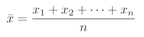

# Explore Numerical Data

## Introduction

**Numerical Data** are numbers and therefore possible to do basic arithmetic.

## Data Matrix

## Scatterplots and Dotplot

Good for checking associations between variables and the nature of that assocoation.

A one variable scatterplot is called a **dotplot**.

## Mean

Calculates the **centrer** of a distribution.

The sample mean is described by **x&#772;**.

The population mean is described by **&#956;**.

going for 1.6.3

---
Also known as **Dataframe**.

Follow the [tidy data](https://github.com/CGodinho/R/blob/master/02-Concepts/tidy_data.md) principle with:

* Each **row represents** an **observation** (or case);
* Each **column** represents a **variable** (or characteristic). It is recommended to explicitly describe the variable content and units in an adjacent summary description.
