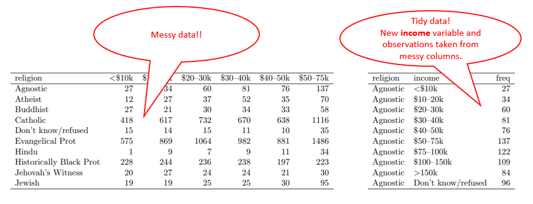

# Tidy Data

## Introduction

The concept focus on how to **structure datasets** in order to facilitate its analysis.

## Definition

Tidy data is a standard way of mapping the meaning of a dataset to its structure. In tidy data:

1. Each variable forms a column;
2. Each observation forms a row;
3. Each type of observational unit forms a table.

The concept is based on  3NF, but applied to datasets.

The opposite of a **tidy** dataset is a **messy** dataset.

Many R packages receive as input data in **tidy format**. Package [dplyr](https://github.com/CGodinho/R/tree/master/03-Packages/dplyr.md) is used to mutate data into tidy format.

## Example

## Links

 * Created by Hadley Wickham and initially introduced in [The Journal of Statistical Software , volume 59, issue 10](https://www.jstatsoft.org/article/view/v059i10).

 * [3NF - 3rd normal form rule](<https://en.wikipedia.org/wiki/Third_normal_form>)